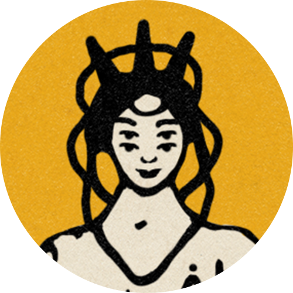

# People we've worked with

<figure><figcaption>
Spicy Tuna RPG
</figcaption></figure>

 

<figure><figcaption>
The Lost Bay Studio
</figcaption></figure>

 

<figure><figcaption>
Lost Ways Club
</figcaption></figure>

 

<figure><figcaption>
UKGovcamp '21
</figcaption></figure>

 

<figure><figcaption>
UKGovcamp '22
</figcaption></figure>

 

<figure><figcaption>
&#x3C;R. U. Hacking?/>
</figcaption></figure>

 

<figure><figcaption>
You Got This! 
</figcaption></figure>

 

<figure><figcaption>
Lost in Cult
</figcaption></figure>

 

<figure><figcaption>
HackNotts
</figcaption></figure>

 

<figure><figcaption>
Hinokodo
</figcaption></figure>

